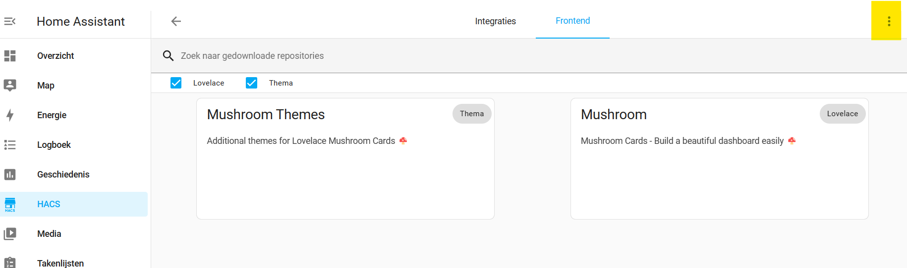
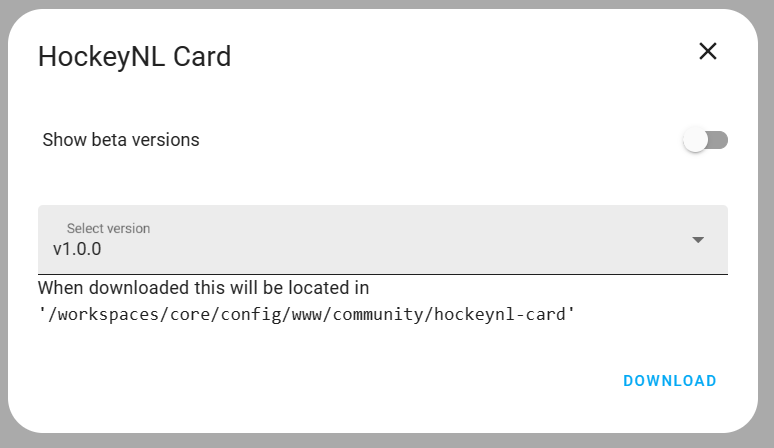
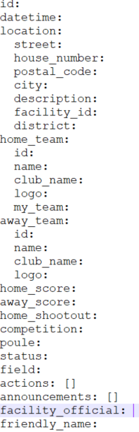
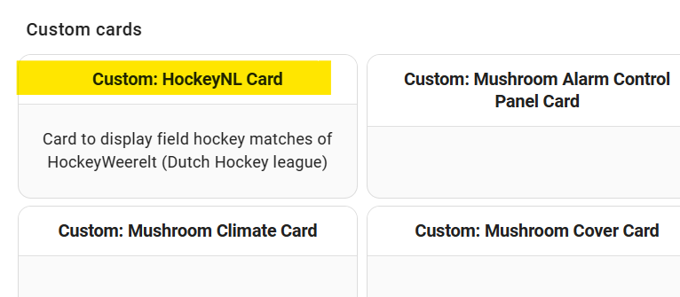
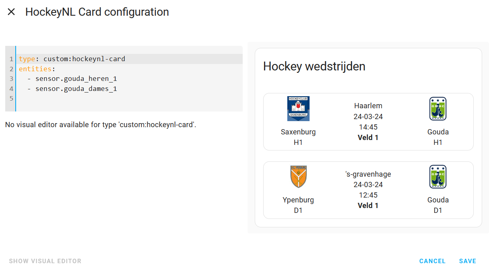

# hockeynl-card
HA Card for dutch field hockey-league
This card wil show a home assistant sensor created with https://github.com/joosthoi1/hockey-team-tracker as a neat card. 

## How to install the card
Install the card via HACS is the best solution. Go to HACS tab and  and choose front-end, ... (marked yellow) and choose custom repositories

Choose https://github.com/MadSnuif/hockeynl-card as repository and category Lovelace
Since it for now is a custom repository you have to download it with the button in Home Assistant.

It will be added to the correct location for HACS cards.
As stated the card needs to have sensors created with https://github.com/joosthoi1/hockey-team-tracker. You can add your own sensors but you need to understand the underlaying API. A typical sensor would look somthing like:

## How to use the card
In Home Assistant add on your page a new card, and choose custom: HockeyNL Card

Add the sensors in code in the card:
for example two team sensors will need:

type: custom:hockeynl-card
entities:
  - sensor.gouda_heren_1
  - sensor.gouda_dames_1

Enjoy the card!
